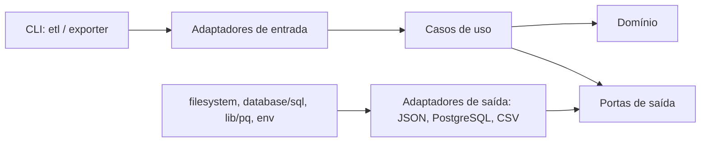

# Plano de adequação à Clean Architecture

## Objetivo e critério de conformidade

A Clean Architecture organiza o software pela **direção de dependência**, e não por tecnologia ou nome de diretório. Regras de negócio ficam no centro; casos de uso dependem delas; adaptadores traduzem dados entre o centro e o exterior; banco, arquivos, ambiente, drivers e frameworks ficam na borda. Uma dependência de compilação só pode apontar para dentro.



O projeto já tem uma base útil: `internal/usecases` não importa PostgreSQL ou sistema de arquivos, e fontes JSON, repositórios PostgreSQL e exportador CSV implementam interfaces. Ter pacotes chamados `ports` e `adapters`, contudo, não basta: contratos, modelos e composição também precisam respeitar a direção acima.

## Diagnóstico do estado atual

| Área | Evidência | Consequência |
| --- | --- | --- |
| Domínio | `domain.Game` contém tags `json`; `Pokemon` e `PokemonAvailability` expõem `Id` e `PokemonId`. | O núcleo conhece serialização e identidade relacional. |
| Entrada Pokémon | `ports.PokemonSource` devolve `[]dto.PokemonJson`; `NormalizePokemon` importa `dto`. | O contrato interno conhece formato e nome do protocolo externo. |
| Saída CSV | `ExportPokemonAvailabilityDetails` monta cabeçalho, `[][]string` e caminho `.outputs/%03d_*.csv`. | O caso de uso conhece apresentação, arquivo e diretório. |
| Portas | Interfaces estão no pacote global `internal/ports`; uma importa `internal/usecases/models`. | A fronteira fica difusa e acoplada à árvore de pacotes. |
| Composição | Os comandos recebem `*sql.DB`, criam adaptadores e orquestram vários casos de uso; `internal/app` lê ambiente e importa PostgreSQL. | Entrega, bootstrap, banco e política de aplicação se misturam. |
| Banco | A conexão lê `os.Getenv`; `InitSchema` executa DDL no ETL. | Configuração e provisionamento ficam ocultos em infraestrutura. |
| Carga | `SaveNormalizedPokemons` usa três repositórios e ignora o erro de `RefreshMaterializedView`. | Não há unidade de trabalho explícita e há falha silenciosa. |
| Leitura | A projeção retorna `Id`, `Game` e `MethodDescription`, que o CSV atual não usa. | O modelo é guiado pela consulta SQL, não pela necessidade da aplicação. |

Clean Architecture não exige objetos ricos em todos os lugares nem uma camada para cada operação trivial. As mudanças seguintes removem dependências voltadas para fora; não são uma renomeação cosmética de diretórios.

## Estrutura-alvo

```text
cmd/
  etl/main.go                         # entrada e bootstrap
  exporter/main.go
internal/
  domain/                             # entidades e regras puras
  application/
    importcatalog/                    # caso de uso, modelos e portas
    exportavailability/
  adapters/
    in/cli/                           # traduz CLI para comandos
    out/json/                         # lê JSON e converte para modelo interno
    out/postgres/                     # armazenamento e consulta
    out/csv/                          # renderiza e grava relatório
  infrastructure/
    config/                           # .env e configuração tipada
    postgres/                         # conexão, migrações, detalhes SQL
    filesystem/                       # I/O compartilhado, se necessário
migrations/                           # DDL versionado
```

Os nomes podem variar. O requisito é que `domain` e `application` não importem `adapters`, `infrastructure`, `database/sql`, `os`, serializadores, drivers ou bibliotecas de ambiente. `cmd` fica na borda e pode compor implementações concretas.

## Mudanças necessárias

### 1. Liberar o domínio de transporte e persistência

Remover as tags JSON de `domain.Game`. Estruturas privadas, como `gameJSON`, devem existir no adaptador JSON e converter cada registro para `domain.Game`. Mover os atuais `dto.PokemonJson` e `dto.PokemonAvailabilityJson` para esse adaptador: eles são o contrato do arquivo, não do negócio.

Remover `Pokemon.Id` e `PokemonAvailability.PokemonId` das entidades. Serial e chave estrangeira são decisões do PostgreSQL. O adaptador de persistência pode associá-los internamente, ou a aplicação pode usar a chave de negócio `number + form`.

Manter no domínio apenas Pokémon, forma, jogo, método e disponibilidade. Se o produto exigir invariantes — número positivo, abreviação obrigatória, método obrigatório — validá-las ao criar os valores de domínio, sem inventar regras não existentes.

**Justificativa:** entidades ocupam o anel mais interno e não podem depender de convenções de serialização, tabelas ou estratégia de identificação.

### 2. Modelar casos de uso pela intenção

Substituir a sequência pública de `LoadGames`, `SaveGames`, `LoadMethods`, `SaveMethods`, `NormalizePokemon` e `SaveNormalizedPokemons` por ações completas:

- `ImportCatalog.Execute(ctx, ImportCatalogCommand)`: lê, normaliza, persiste o catálogo e garante a projeção necessária.
- `ExportAvailability.Execute(ctx, ExportAvailabilityCommand)`: obtém disponibilidades e produz um relatório por jogo.

Os serviços menores podem continuar como funções privadas quando ajudam a leitura. Não devem ser APIs apenas porque representam uma chamada de I/O. Definir uma interface de entrada para o caso de uso quando houver múltiplos adaptadores de entrada ou quando isso melhorar testes:

```go
type ImportCatalog interface {
    Execute(context.Context, ImportCatalogCommand) error
}
```

Passar `context.Context` pelas entradas e portas de saída para permitir cancelamento e prazo nas operações externas.

**Justificativa:** casos de uso são políticas da aplicação; CLI não deve decidir sua sequência.

### 3. Declarar portas de saída junto de quem as consome

Eliminar o pacote global `internal/ports` e declarar interfaces pequenas em `internal/application/importcatalog` e `internal/application/exportavailability`:

```go
type CatalogSource interface {
    Load(context.Context) (CatalogImport, error)
}
type CatalogStore interface {
    Upsert(context.Context, CatalogImport) error
}
type AvailabilityReader interface {
    ByGame(context.Context, GameCode) ([]AvailabilityRow, error)
}
type AvailabilityReportWriter interface {
    Write(context.Context, AvailabilityReport) error
}
```

`CatalogImport`, `AvailabilityRow` e `AvailabilityReport` pertencem à aplicação e carregam só os dados necessários. `AvailabilityRow` não deve expor `Id`, `MethodDescription` ou outros campos sem consumidor.

Não modelar portas como tabelas por padrão (`Save`, `SaveAll`, `GetAll`). A porta deve expressar a colaboração que o caso de uso precisa. Assim, PostgreSQL pode implementar uma importação transacional sem expor `*sql.DB`, `INSERT`, view materializada ou chave substituta.

**Justificativa:** a abstração pertence a quem a usa. Isso inverte a dependência dos detalhes para a política.

### 4. Confinar JSON e CSV aos adaptadores

O adaptador JSON deve desserializar estruturas privadas com tags e convertê-las para `CatalogImport`; nenhuma assinatura interna deve conter tipos chamados `*Json`.

O adaptador CSV deve receber `AvailabilityReport` sem formatação física e decidir cabeçalho, `[][]string`, escaping e escrita. A política de nome deve ficar explícita: se ela for regra de produto, a aplicação informa um identificador lógico; se for detalhe técnico, o adaptador recebe `OutputDirectory` ao ser construído e gera o caminho. Remover `.outputs` e `fmt.Sprintf("*.csv")` de `ExportPokemonAvailabilityDetails`.

Classificar as regras atuais antes de mover:

- agrupamento de métodos, número com zeros e conteúdo das notas ficam na aplicação se forem o relatório esperado pelo usuário;
- escaping CSV, cabeçalho físico e diretório ficam no adaptador CSV.

**Justificativa:** adaptadores traduzem protocolos externos; JSON, CSV e caminhos são detalhes externos.

### 5. Isolar bootstrap, configuração e schema

Trocar `internal/app` por bootstrap explícito em `cmd` ou `internal/infrastructure/bootstrap`. Ele deve carregar `.env` como conveniência local, converter ambiente para uma `Config` tipada e validada, construir PostgreSQL por configuração injetada, aplicar migrações e injetar adaptadores nos casos de uso.

`postgres.NewPostgresConnection` deve receber `PostgresConfig`, não chamar `os.Getenv`. Mover o DDL de `InitSchema` para migrações versionadas, executadas no deploy ou em uma etapa própria antes do ETL.

**Justificativa:** ambiente, driver, DDL e composição pertencem à camada externa e podem depender de todos os anéis; nenhum anel interno pode depender deles.

### 6. Tornar a importação atômica

Fazer `CatalogStore.Upsert` (ou `Replace`, conforme a regra de negócio) controlar uma transação PostgreSQL única para jogos, métodos, Pokémon, disponibilidades e atualização da projeção. A aplicação recebe sucesso ou erro da operação completa.

Propagar o erro de `RefreshMaterializedView`, hoje descartado. Definir se a view é requisito para considerar a importação concluída; se for só otimização de leitura, o adaptador PostgreSQL a controla internamente. Se for condição para exportar dados corretos, a porta de armazenamento só retorna sucesso depois dela.

**Justificativa:** consistência é uma política da aplicação; transação e view são mecanismos externos escondidos pela porta.

### 7. Ajustar os testes aos anéis

Testar `domain` sem mocks e I/O. Testar casos de uso com dublês das portas no pacote da aplicação, verificando comando, resultado e erro. Testar adaptadores PostgreSQL com `sqlmock` ou integração e adaptadores JSON/CSV com testes de contrato. Os testes de `cmd` deixam de ser testes de SQL e verificam somente bootstrap e apresentação de erro.

Adicionar um teste que comprove a propagação de falha ao atualizar a projeção.

**Justificativa:** cada teste passa a verificar a responsabilidade de seu anel, sem banco simulado para testar uma CLI.

## Ordem de migração

1. Criar modelos de aplicação e portas por caso de uso, com adaptadores de compatibilidade temporários.
2. Extrair `ImportCatalog` e `ExportAvailability` e cobrir o comportamento atual com testes de unidade.
3. Migrar JSON e CSV para traduzirem nas bordas e remover `dto` do núcleo.
4. Implementar armazenamento PostgreSQL transacional e propagar falha de projeção.
5. Separar configuração, conexão e DDL em bootstrap/migrações e simplificar os dois `main`.
6. Remover `internal/ports`, `internal/app` e contratos antigos quando não houver importações.

## Critérios de aceite

- `domain` e `application` compilam sem imports de banco, arquivos, serializadores, drivers, ambiente, adaptadores ou infraestrutura.
- Nenhuma porta recebe tags JSON/CSV, caminho, SQL ou nome de tabela.
- Cada caso de uso tem entrada explícita e portas de saída orientadas à necessidade.
- Uma falha de persistência ou projeção exigida retorna erro e a importação não fica parcialmente confirmada.
- `main` apenas carrega configuração, compõe dependências e invoca uma porta de entrada; testes de negócio executam sem PostgreSQL, arquivos ou `sqlmock`.

