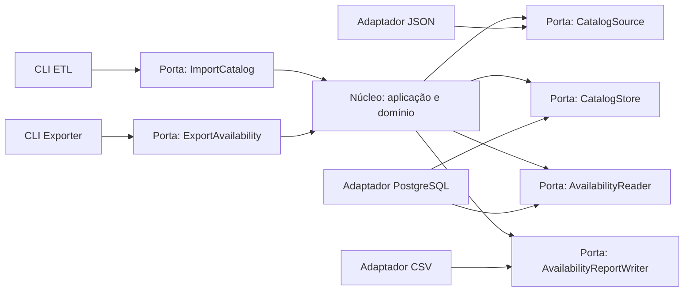

# Plano de adequação à Arquitetura Hexagonal

## Objetivo e critério de conformidade

Na Arquitetura Hexagonal (Ports and Adapters), o núcleo oferece **portas de entrada** para quem o aciona e define **portas de saída** para os recursos de que precisa. Adaptadores externos traduzem protocolos concretos para essas portas. O núcleo não deve saber se foi acionado por CLI, HTTP ou fila, nem se lê JSON, usa PostgreSQL ou escreve CSV.

| Papel | Elemento atual | Avaliação |
| --- | --- | --- |
| Núcleo | `internal/domain` e `internal/usecases` | Boa separação inicial, mas modelos de transporte e persistência atravessam o núcleo. |
| Adaptador de entrada (driving) | `cmd/etl`, `cmd/exporter` | São os acionadores corretos, mas compõem banco e orquestram fluxo de aplicação. |
| Portas de saída (driven) | `internal/ports` | Há interfaces, mas são globais, com nomes de CRUD e uma depende de `usecases/models`. |
| Adaptadores de saída | JSON, PostgreSQL, CSV | Implementam interfaces, mas deixam formato JSON/CSV vazar para dentro. |
| Detalhes técnicos | `internal/infra`, `internal/app` | Estão fora do domínio, porém bootstrap, schema e configuração não têm limite claro. |



As setas de adaptadores de saída para as portas indicam implementação. A assinatura da porta pertence ao núcleo; não é uma interface oferecida pelo banco, arquivo ou biblioteca.

## Desvios encontrados

### A API de entrada não é explícita

Os construtores e `Execute` de `LoadGames`, `SaveGames`, `NormalizePokemon` e outros são utilizáveis, mas não há uma porta de entrada que represente as duas ações do produto: importar catálogo e exportar disponibilidades. Em `cmd/etl/main.go`, `persistGames`, `persistMethods` e `persistNormalizedPokemon` decidem a sequência e recebem `*sql.DB`. Em `cmd/exporter/main.go`, a CLI recarrega jogos e faz o laço de exportação.

Isso prende a aplicação à CLI e dificulta adicionar HTTP, uma fila ou um job agendado sem reproduzir a orquestração.

### Portas refletem tecnologia e dados externos

`PokemonSource.LoadPokemonsJson` devolve DTO nomeado pelo formato JSON. `NormalizePokemon` precisa conhecê-lo, portanto JSON não está só no adaptador. `PokemonAvailabilityDetailExporter` recebe caminho e `[][]string`, enquanto o caso de uso cria o arquivo em `.outputs`: a porta é de CSV/sistema de arquivos, não uma saída semântica.

`PokemonAvailabilityDetailRepository` importa `internal/usecases/models`. Embora compile, o contrato fica fora do módulo consumidor e expõe a projeção SQL. Seus campos `Id`, `Game` e `MethodDescription` não alimentam o CSV atual.

### A colaboração de saída não promete uma operação completa

`SaveNormalizedPokemons` chama três repositórios e atualiza uma view materializada. Não há porta que prometa que toda a importação foi confirmada, e o erro de `RefreshMaterializedView` é ignorado. O resultado pode ser carga parcial ou exportação sobre projeção desatualizada.

### Bootstrap se mistura aos adaptadores

`internal/app` lê `.env`, abre PostgreSQL e inicializa schema. A conexão lê ambiente diretamente. Isso não viola por si só o isolamento do núcleo, mas esconde o limite operacional e impede construir o adaptador por uma configuração explícita. DDL a cada ETL também mistura provisionamento com o caso de uso.

## Hexágono proposto

Criar dois módulos de aplicação; cada um é dono da porta de entrada, dos seus modelos e das portas de saída.

```go
// internal/application/importcatalog/port.go
type InputPort interface {
    Execute(context.Context, Command) error
}
type Source interface {
    Load(context.Context) (Catalog, error)
}
type Store interface {
    Upsert(context.Context, Catalog) error
}

// internal/application/exportavailability/port.go
type InputPort interface {
    Execute(context.Context, Command) error
}
type Reader interface {
    ByGame(context.Context, domain.Game) ([]Row, error)
}
type Writer interface {
    Write(context.Context, Report) error
}
```

`Command`, `Catalog`, `Row` e `Report` são modelos da aplicação. Não contêm tags JSON/CSV, `*sql.DB`, nomes de tabela nem caminhos físicos. Uma porta única de `Source` pode devolver o catálogo inteiro se jogos, métodos e Pokémon sempre são importados juntos. Caso sejam operações independentes, criar portas menores por caso de uso, não uma coleção global de repositórios.

A implementação de `InputPort` coordena portas de saída. O adaptador de entrada constrói o comando e chama `Execute`; ele não consulta SQL nem decide a ordem interna do trabalho.

## Mudanças necessárias e justificativa

| Mudança | Como executar | Justificativa hexagonal |
| --- | --- | --- |
| Criar portas de entrada | Expor `ImportCatalog` e `ExportAvailability`, com comandos e `context.Context`. Mover para elas o fluxo de `runEtl` e `runExporter`. | CLI, HTTP e jobs tornam-se clientes intercambiáveis do núcleo. |
| Afinar os comandos | CLI lê argumentos/configuração, constrói dependências, cria comando e chama porta. Remover `*sql.DB`, `persist*`, laço por jogos e regra de negócio de `cmd`. | Adaptador driving traduz protocolo de entrada; não contém a aplicação. |
| Trocar `PokemonSource` | Adaptador JSON desserializa structs privadas e converte para `importcatalog.Catalog`. Remover `internal/dto` das assinaturas e de `NormalizePokemon`. | A fonte pode mudar sem modificar o núcleo. |
| Dono local das portas | Mover `internal/ports` para os módulos que consomem cada interface. Remover métodos como `GameRepository.GetAll` se nenhum caso de uso os requer. | A aplicação, não PostgreSQL, define o contrato de seus colaboradores. |
| Porta de catálogo transacional | PostgreSQL implementa `CatalogStore.Upsert` ou `Replace` em uma transação; encapsula `pokemon_id`, SQL e view. | O núcleo pede capacidade de negócio, sem detalhes de banco. |
| Contrato da projeção | Propagar falha de refresh e decidir se a view é condição de sucesso ou otimização interna do store. | Uma porta deve informar corretamente êxito e falha da colaboração externa. |
| Relatório semântico | Aplicação produz `Report`; CSV gera cabeçalho, campos, escaping e arquivo. Diretório é configuração do adaptador ou destino lógico do comando. | CSV e caminho pertencem ao protocolo de saída. |
| Limpar domínio | Mapear JSON na borda e manter serial/FK no PostgreSQL; remover tags e IDs técnicos das entidades. | O núcleo fica independente de protocolo e armazenamento. |
| Separar bootstrap | Criar configuração tipada na borda, injetar `PostgresConfig`, mover DDL para migrações versionadas. | Driver, ambiente e provisionamento são detalhes substituíveis. |
| Confinar I/O | Manter `filesystem.ReadJson` e `WriteCSV` privados dos adaptadores ou em infraestrutura; aplicação não os chama. | Bibliotecas e I/O ficam fora do hexágono. |

O agrupamento de métodos, o número com zeros e o conteúdo das notas exigem classificação durante a extração. Se fazem parte do relatório esperado pelo usuário, a aplicação os entrega em `Report`; se existem para a sintaxe CSV, o adaptador os aplica. Essa decisão permite acrescentar JSON ou HTTP como saída sem copiar regras por acidente.

## Adaptadores resultantes

| Adaptador | Porta | Responsabilidade |
| --- | --- | --- |
| `cli/etl` | consome `importcatalog.InputPort` | Converte argumentos/configuração em comando, apresenta erro e código de saída. |
| `cli/exporter` | consome `exportavailability.InputPort` | Aciona exportação com filtros e destino. |
| `jsoncatalog` | implementa `importcatalog.Source` | Percorre arquivos, desserializa JSON e converte ao modelo interno. |
| `postgrescatalog` | implementa `importcatalog.Store` | Executa upsert transacional e mantém projeções técnicas. |
| `postgresavailability` | implementa `exportavailability.Reader` | Consulta e mapeia a projeção para `Row`, sem expor `sql.Rows`. |
| `csvreport` | implementa `exportavailability.Writer` | Converte `Report` em CSV no destino configurado. |

Uma mesma implementação PostgreSQL pode satisfazer duas portas, desde que seus contratos permaneçam separados. A separação é pela necessidade do núcleo, não pelo número de conexões ou de pacotes.

## Estratégia de transição

1. Cobrir o comportamento atual de normalização e exportação com testes de unidade, usando dublês das portas.
2. Introduzir portas e modelos novos, mantendo adaptadores existentes por compatibilidade temporária.
3. Alterar os dois comandos para chamar somente portas de entrada.
4. Mover a tradução JSON e CSV para as bordas e remover `dto` das assinaturas internas.
5. Consolidar escrita PostgreSQL em transação e mover schema/configuração para bootstrap e migração.
6. Apagar `internal/ports`, `internal/app`, DTOs e métodos sem consumidores; então reorganizar pacotes por adaptador.

## Critérios de aceite

- Importação e exportação executam com implementações em memória das portas, sem JSON, CSV, PostgreSQL, `sqlmock` ou ambiente.
- Uma entrada HTTP pode chamar as mesmas portas sem importar `cmd` nem duplicar fluxo.
- Trocar JSON, PostgreSQL ou CSV exige trocar/criar adaptador, sem alterar domínio ou casos de uso.
- Toda falha que impeça catálogo exportável retorna erro e a importação usa unidade transacional definida.
- `internal/application` e `internal/domain` não importam adaptadores, infraestrutura, banco, sistema de arquivos, serializadores ou driver PostgreSQL.

